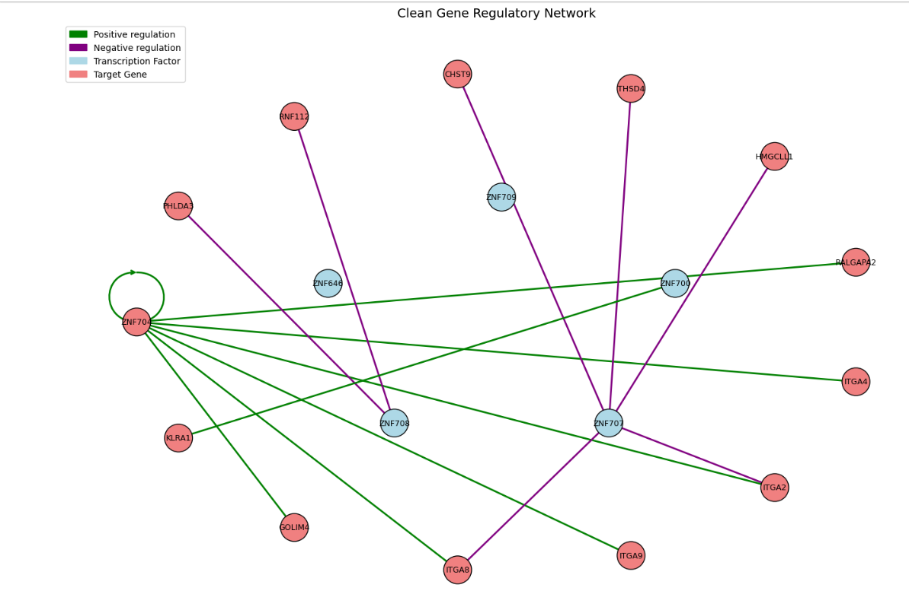

# 🧬 Gene Regulatory Network (GRN) Construction & Analysis

This project focuses on constructing a **Gene Regulatory Network** from gene expression data using known **Human Transcription Factors (TFs)** from [HumanTFs](https://humantfs.ccbr.utoronto.ca/). The GRN is modeled and analyzed using graph theory to uncover potential regulatory interactions between genes.

---

## 🌐 Dataset

- **Gene Expression Data**: A `.csv` file containing expression levels of genes.
- **Transcription Factors List**: Downloaded from [HumanTFs Database](https://humantfs.ccbr.utoronto.ca/download.php), which provides a curated list of human TFs and co-TFs.

---

## 🧪 Methodology

1. **Data Preparation**
   - Load gene expression data.
   - Normalize and clean data if necessary.
   - Map genes with known transcription factors using HumanTFs.

2. **Interaction Inference**
   - Finding the relating between genes and transciption factors using pearson coefficient, Linear Regression and Lassor Regression.

3. **Graph Construction**
   - Construct a **directed graph** using NetworkX where:
     - Nodes = Genes (TFs and targets)
     - Edges = Regulatory interactions (from TFs to target genes)

4. **Analysis & Visualization**
   - Visualize the network using NetworkX and Matplotlib.
   - Perform centrality analysis to identify key regulators.
   - Export graph metrics (e.g., degree, betweenness) for biological interpretation.

---

## 🛠️ Installation

Instructions to install and run the project.

Netowork.py is the main file for constructing the gene regulatory network.


tfs.txt file is a must, before running please download it as it contains all the name of the transcription factors, if you want for some other organism use your file, in same format- only names of transcription factors.


For using it use the following commands
```bash
from Network import *
gene = Gene_Network(path_to_gene_expression_file, 'tfs.txt')
gene.network_one()
gene.network_two()
gene.network_three()
```

Network functions also give us flexibility, to set the threshold values. Try putting threhsold network_one(0.1,-0.1) manually, so that the threshold will be updated, and according to threshold gene relations we will get. If you don't put any threshold, the default, is (0.7, -0.7), for changing it and viewing various patterns of gene network try using it.
## 🧠 GRN Construction Methods

This project offers three methods to construct Gene Regulatory Networks (GRNs):

- `network_one()`: Constructs the GRN using a **correlation-based approach**, identifying gene-gene relationships based on Pearson correlation coefficients.

- `network_two()`: Constructs the GRN using **Linear Regression**, modeling the influence of transcription factors on target gene expression levels.

- `network_three()`: Constructs the GRN using **Lasso Regression**, which adds L1 regularization to Linear Regression to encourage sparsity and feature selection in regulatory links.

  ## 🖼️ GRN Visualization

Below is a sample output of the constructed Gene Regulatory Network:



